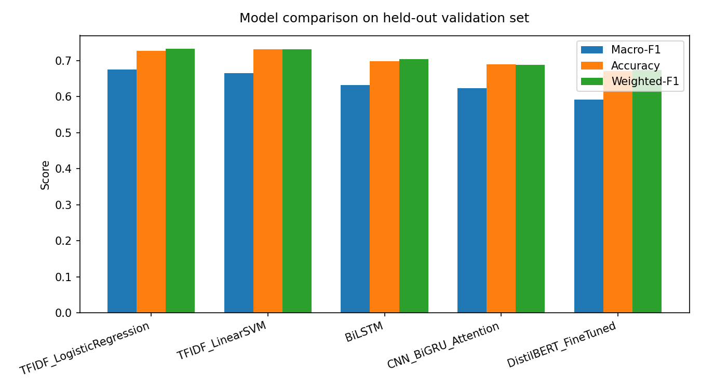
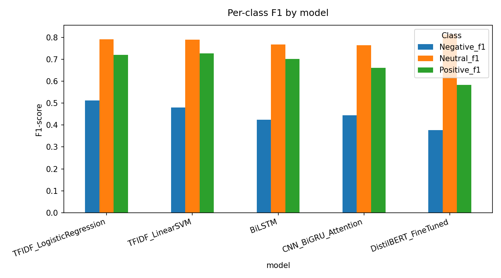
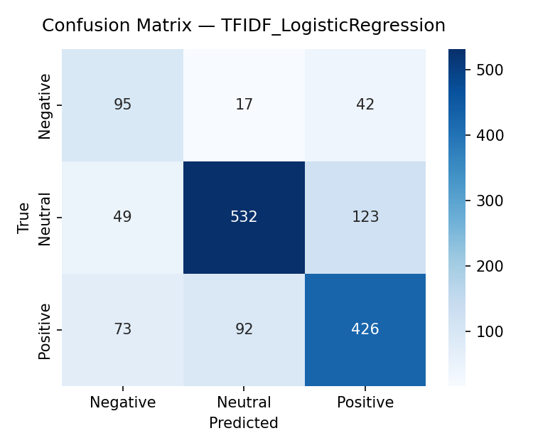
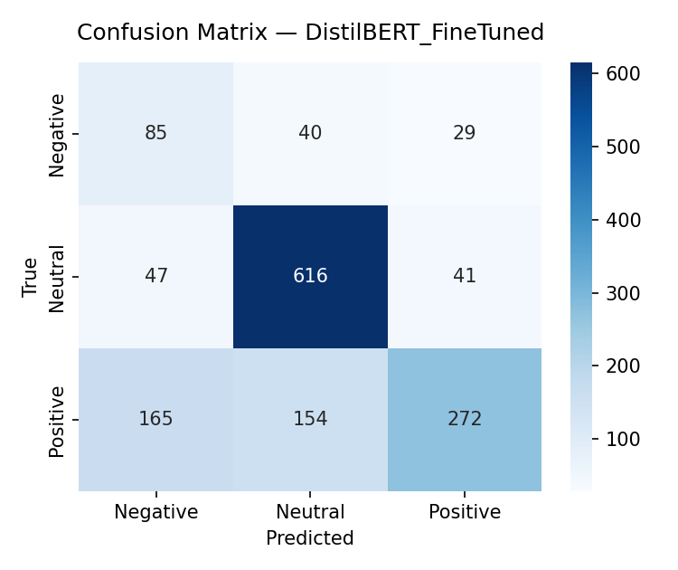
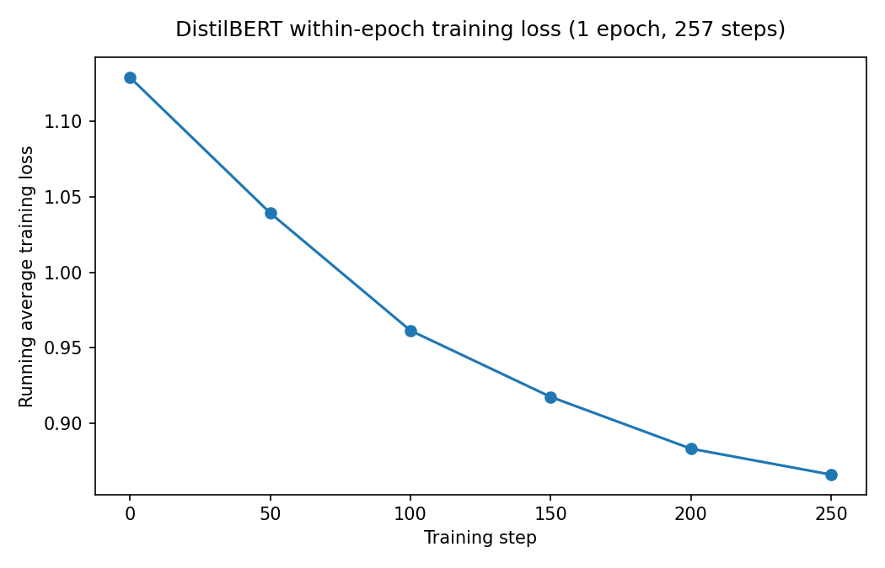

# 1. Introduction

Vaccine hesitancy on social media is something public-health teams actually track — knowing the volume and tone of anti-vaccine sentiment helps them decide where to focus. This report is our attempt to answer the assignment's broad question — how effectively can sequential modelling approaches tackle a real NLP problem, and what evidence backs up the strengths and limits of whatever we pick — for the specific case of sentiment classification on vaccine-related tweets, using Zindi's "To Vaccinate or Not to Vaccinate: It's Not a Question" dataset.

We picked this challenge partly because vaccine hesitancy is a public-health issue with direct relevance to African contexts: it's hosted on Zindi, Africa's data-science competition platform, and the same underlying problem — telling genuine vaccine-hesitancy sentiment apart from noise at social-media scale — has already been studied on South African Twitter data (see Section 2). So this isn't just a Western concern dressed up as a challenge dataset. We treat the task as 3-class classification: Negative, Neutral, or Positive.

Five approaches are compared here — two classical bag-of-words baselines, and three neural sequential models of increasing complexity (a BiLSTM trained from scratch, a CNN+BiGRU+Attention hybrid, and a fine-tuned DistilBERT) — all evaluated on the same train/validation split with macro-F1 as the main metric, chosen because the classes are imbalanced. Every choice described below, from text cleaning to sequence length to the metric itself, traces back to something we actually found in our own EDA (Section 3), not just convention.

# 2. Related Work and Sequential Model Selection

*(Full section in [`related_work.md`](related_work.md), merged into the PDF build. It covers the canonical sequential-architecture papers — LSTM, GRU, CNN for text, attention, Transformer, BERT, DistilBERT, GloVe — plus vaccine-hesitancy-specific Twitter sentiment work including an African-context study, the original Zindi challenge background, and the reasoning behind each of our five chosen approaches.)*

# 3. Dataset and Exploratory Data Analysis

*(Full section in [`eda_summary.md`](eda_summary.md), with all 9 figures, merged into the PDF build. The headline numbers we keep coming back to: 10,000 usable training tweets after cleaning; a class split of roughly Neutral 49% / Positive 41% / Negative 10%; 23% of duplicate-text groups carrying conflicting labels; a 39.7% out-of-vocabulary rate between train and test; the `#mmr` hashtag turning out to be mostly unrelated content; and all three classes sharing the same core vocabulary, meaning the signal that separates them is in word order and framing, not which words show up.)*

# 4. Methodology

## 4.1 Shared preprocessing (`src/preprocessing.py`)
Every approach sees identically cleaned text, so whatever differences show up in the results come from the model, not from inconsistent preprocessing:
1. HTML-unescape every tweet (5.9% had raw entities — EDA finding #6).
2. Normalise `<user>`/`<url>` placeholders into single consistent tokens.
3. Collapse elongated letters (`soooo` -> `soo`) to keep the emphasis without letting spelling variants blow up the vocabulary.
4. Resolve duplicate-text groups before splitting — for tweets with identical cleaned text but conflicting labels (EDA finding #3), keep the highest-agreement one and drop the rest, before the train/validation split so nothing leaks across it.

## 4.2 Shared train/validation split (`src/data_split.py`)
One stratified 85/15 split (seed=42) of the cleaned, de-duplicated data — 9,654 rows down to 8,205 train / 1,449 validation — used by every notebook, so the numbers are actually comparable across models. Zindi's `Test.csv` has no public labels, so everything reported here is on our own held-out validation set.

## 4.3 Approach 1-2: Classical baselines (`notebooks/baselines.ipynb`)
TF-IDF (word 1-2 grams, `min_df=2`, top 20k features, sublinear TF) feeding two class-weighted linear classifiers — Logistic Regression and Linear SVM. The point of these is to see how far bag-of-words gets before bothering with anything sequence-aware.

## 4.4 Approach 3: BiLSTM (`notebooks/bilstm.ipynb`)
A single-layer bidirectional LSTM (embed_dim=128, hidden_dim=128) over a vocabulary built from the training data (about 7k words after `min_freq=2` filtering), `max_seq_len=32` based on EDA finding #4. Trained with class-weighted cross-entropy, Adam at lr=1e-3, early stopping on validation macro-F1 with patience 3.

## 4.5 Approach 4: CNN + BiGRU + Attention (`notebooks/cnn_bigru_attention.ipynb`)
Parallel 1D convolutions (kernel widths 2/3/4, 64 filters each — following Kim, 2014) pull out local n-gram patterns, which feed into a bidirectional GRU (hidden=96, Cho et al., 2014), pooled through an additive attention layer (Bahdanau et al., 2015) that can learn to down-weight uninformative tokens — aimed squarely at the `#mmr` problem from EDA finding #7. Same training setup as the BiLSTM otherwise. This hybrid architecture has roughly 1.1M trainable parameters (vs. the BiLSTM's ~0.9M), with the extra capacity concentrated in the convolutional filters rather than the recurrent hidden state — a deliberate trade-off favouring local pattern extraction over deeper recurrence.

## 4.6 Approach 5: Fine-tuned DistilBERT (`notebooks/distilbert_finetuned.ipynb`)
`distilbert-base-uncased` (Sanh et al., 2019), a distilled version of BERT (Devlin et al., 2019), fine-tuned end-to-end with its own WordPiece tokenizer (`max_length=32`), AdamW at lr=2e-5, batch size 32, class-weighted cross-entropy. The subword tokenization here is specifically meant to deal with the 39.7% OOV rate (EDA finding #9) that the word-level models in 4.4 and 4.5 just can't handle gracefully. We benchmarked the CPU throughput first — about 150-240ms per sample for a forward+backward pass, which works out to roughly 25-30 minutes per epoch on this 4-core, no-GPU machine — and settled on 1 epoch rather than the 2-3 that would be normal with a GPU. That's a compute-budget constraint we're upfront about, not a modelling choice (see Section 6).

## 4.7 Evaluation protocol (`src/eval_utils.py`)
Every approach gets scored the same way: macro-F1 as the headline number, plus weighted-F1, accuracy, per-class precision/recall/F1, a confusion matrix, and one-vs-rest ROC/PR curves — all saved to `reports/results/*.json` and `figures/cm_*.png`/`figures/roc_pr_*.png`.

Macro-F1 over accuracy follows Sokolova & Lapalme (2009), who show macro-averaged measures are the right call when performance on rare classes matters as much as on common ones — our situation exactly, given Negative is only 10.4% of the data (finding #1) but is arguably the class that matters most for a real deployment. We also report weighted-F1 alongside it: where macro-F1 treats every class equally regardless of support, weighted-F1 gives each class weight proportional to its sample count, so comparing the two reveals how much the rare-class performance is dragging down (or propping up) the headline number. Macro-F1 has a known downside, though: with only 154 Negative examples in validation, a handful of flipped predictions can move the macro score more than the class's real-world frequency would justify — worth remembering when comparing models that differ by only a point or two. The ROC/PR curves address a different blind spot: Fawcett (2006) notes that ROC-AUC measures ranking quality independent of any specific decision threshold, which is exactly why it can disagree with a thresholded metric like macro-F1 (see DistilBERT's results in Section 5) — and also why ROC curves alone can look optimistic under heavy class imbalance, which is why we report Precision-Recall curves alongside them rather than relying on ROC-AUC in isolation.

## 4.8 Hyperparameter-tuning experiments (`notebooks/ablation_experiments.ipynb`)
The settings in 4.3-4.6 aren't just defaults we picked and moved on from — we ran three small ablations, each testing one EDA-motivated decision against a real alternative on the same split, to see if it actually paid off.

| # | Design decision tested | Alternative | Result | What it tells us |
|---|---|---|---|---|
| A | TF-IDF `ngram_range=(1,2)` (used in 4.3) | Unigrams only, `(1,1)` | Unigram macro-F1 0.6592 vs. 1-2gram macro-F1 0.6747 (+0.0155) | Bigrams genuinely help — EDA finding #11 about phrases like `cause autism` carrying sentiment actually shows up as a measurable gain, so `(1,2)` earns its place rather than being an arbitrary choice. |
| B | BiLSTM class-weighted cross-entropy (used in 4.4) | Unweighted cross-entropy | Unweighted macro-F1 0.6312 (Negative-F1 0.419) vs. weighted macro-F1 0.6255 (Negative-F1 0.432) | Not a clean win — class weighting does lift Negative-class F1 by 0.013, which is what it's meant to do given finding #1, but it costs enough on Neutral/Positive that overall macro-F1 drops a little (-0.0057). We kept weighting anyway because improving the rarest, most-disputed class seemed like the more defensible goal, but it's worth being honest that it's a trade-off, not a free win. |
| C | CNN+BiGRU+Attention `max_seq_len=32` (used in 4.5) | `max_seq_len=24` (the exact 95th-percentile word length from finding #4) | len=24 macro-F1 0.6134 vs. len=32 macro-F1 0.6228 (+0.0093) | Going a bit past the exact percentile actually helps — truncating right at the 95th percentile throws away enough of the remaining 5% (usually the longer, more complex tweets) to cost real accuracy. |

These are quick, single-variable checks rather than a full grid search — we didn't have the compute budget for that (see 6.4) — but each one tests an actual decision instead of just assuming it was right.

### How much do the headline numbers actually depend on preprocessing, the seed, and the split?

Every result reported so far comes from one preprocessing pipeline, one random seed, and one train/validation split. We tested all three directly rather than just assuming they don't matter:

| # | What was tested | Result | What it tells us |
|---|---|---|---|
| D | Full preprocessing pipeline vs. raw, uncleaned `safe_text`, same TF-IDF+LogReg pipeline | Raw macro-F1 0.6755 vs. cleaned macro-F1 0.6747 — a difference of -0.0008, essentially noise | Preprocessing barely moves TF-IDF's score at all. That's not actually surprising in hindsight: TF-IDF tokenizes on whitespace/punctuation regardless, and the things we clean (HTML entities in 5.9% of tweets, elongated letters in 1.2%) are too rare to shift a bag-of-words model's aggregate score. We still think the cleaning is worth doing — it matters far more for the word-level and subword models (BiLSTM, CNN+BiGRU, DistilBERT), where an un-decoded `&amp;` becomes meaningless sub-tokens rather than just one more rare TF-IDF feature — but we're not going to claim a benefit for TF-IDF that the data doesn't show. |
| E | BiLSTM trained with 3 different random seeds (42, 123, 2024), everything else identical | macro-F1 = 0.6314 / 0.6184 / 0.6202; mean 0.6233, std 0.0057 | Our reported BiLSTM result (0.6314, seed=42) sits at the *top* of this range, not the middle — the main result is somewhat on the favourable side of what a random seed can produce. The spread (std ≈ 0.006, about 1% of the score) is modest but not negligible next to the ~0.01-0.02 gaps that separate some of our five approaches in Section 5. |
| F | 5-fold stratified cross-validation for TF-IDF+LogReg (the best approach) on the full cleaned dataset, vs. the single 85/15 split used everywhere else | Fold scores: 0.6735, 0.6569, 0.6507, 0.6704, 0.6473; CV mean 0.6598, std 0.0105. The single-split result reported in Section 5 is 0.6747 | The single split we used for every headline number in this report is noticeably more favourable than the 5-fold average — about 0.015 higher. That's a real, measured amount of split-dependent optimism in our reported numbers, not just a theoretical risk. |

These three results directly answer the question of how much of our headline numbers is signal versus noise from an arbitrary preprocessing choice, seed, or split: preprocessing doesn't move TF-IDF's score meaningfully, the seed introduces a modest (~0.006) amount of variance, and the split introduces a larger (~0.015) amount — large enough that model rankings within a point or two of each other (e.g. BiLSTM vs. CNN+BiGRU+Attention in Section 5) should be read as "roughly tied" rather than strictly ordered.

### Closing the GloVe gap

Section 2 (`related_work.md`) cites GloVe (Pennington et al., 2014) as the standard justification for using pretrained rather than from-scratch word embeddings — but the main BiLSTM and CNN+BiGRU+Attention results never actually used it. Experiment G tests this directly: the same BiLSTM architecture and training budget as the main result (embed_dim matched to 100 for a fair comparison), comparing GloVe-Twitter 100d embeddings (pretrained on 2 billion tweets — a strong domain match) against from-scratch embeddings, with both fine-tuned during training rather than frozen.

The result: from-scratch macro-F1 0.6420 vs. GloVe-pretrained macro-F1 0.6404 — GloVe is marginally *worse*, not better. This is the opposite of what we expected going in, and the likely explanation is vocabulary coverage: only 63.3% of our training vocabulary actually has a GloVe entry. The missing 37% — Twitter-specific slang, concatenated hashtags, misspellings, the same long tail behind EDA finding #8's 56.4% singleton-word rate — falls back to random initialization anyway, so the model only gets a head start on roughly two-thirds of its vocabulary, and apparently not enough of a head start to show up in the final score at this dataset size. We think this is a more useful result than simply assuming GloVe would help: it shows that a technique cited as standard practice doesn't automatically transfer to this specific, noisy, Twitter-specific dataset, and that subword tokenization (DistilBERT, Section 4.6) — which doesn't have an OOV ceiling at all — is a more principled fix for this dataset's vocabulary problem than word-level pretrained embeddings.

# 5. Results and Discussion

All five approaches were scored on the same held-out validation split (1,449 tweets). Full per-class numbers and confusion matrices live in `reports/results/*.json` and `figures/cm_*.png`; the comparison chart is `figures/10_model_comparison.png`.

| Approach | Macro-F1 | Accuracy | Weighted-F1 |
|---|---|---|---|
| TF-IDF + Logistic Regression | 0.6747 | 0.7267 | 0.7328 |
| TF-IDF + Linear SVM | 0.6652 | 0.7315 | 0.7309 |
| BiLSTM | 0.6314 | 0.6984 | 0.7042 |
| CNN + BiGRU + Attention | 0.6228 | 0.6894 | 0.6877 |
| Fine-tuned DistilBERT (1 epoch) | 0.5912 | 0.6715 | 0.6732 |

The TF-IDF baselines beat both from-scratch neural models on macro-F1, which is worth sitting with rather than brushing off as a fluke. With only about 8,200 training tweets, learning embeddings and a recurrent/convolutional encoder from scratch is genuinely data-hungry, and a well-regularized linear model over strong TF-IDF features is a hard baseline to beat at this scale. This lines up with exactly the motivation Devlin et al. (2019) give for pretraining in the first place — that training a sequence model's representations from scratch is most at a disadvantage precisely on datasets this small, which is also why we didn't initialize the BiLSTM/CNN+BiGRU embeddings from GloVe (Pennington et al., 2014): without a pretrained starting point, from-scratch neural embeddings need more data than we have to reliably beat bag-of-words on short text.

Looking at per-class F1, every model struggles most on Negative (BiLSTM gets 0.42, CNN+BiGRU+Attention gets 0.44) — which makes sense, since Negative is both the rarest class (10.4%) and the one annotators agreed on least (0.713, finding #2), so it's the hardest to learn from and the noisiest to score.

The attention-weight inspection in `notebooks/cnn_bigru_attention.ipynb` shows the model does pick up on sentiment-bearing words in at least some examples — "cause" and "autism" light up for a vaccine-causes-autism tweet — even though that didn't translate into beating the baselines at this amount of training data. Interpretability and raw performance don't always move together.

DistilBERT scoring lowest of the five (macro-F1 0.5912) is the result that needs the most unpacking. We think this comes down to the compute-budget limitation from Section 4.6: one epoch of fine-tuning at a conservative learning rate just isn't enough for a pretrained Transformer to adapt from general English to this short, noisy, domain-specific corpus. The per-class breakdown backs up "undertrained" rather than "wrong architecture" — DistilBERT gets the best Neutral F1 of any model (0.814, versus 0.791 for the best baseline), since the majority class is easy to pick up even with limited fine-tuning, but its Positive recall collapses to 0.46 (F1 0.583, well below every other model's 0.66-0.73) and its Negative F1 (0.377) is the worst of the five. That's the usual pattern for a model whose head hasn't fully adapted yet — confident on the dominant class, still fuzzy on the two minority ones. With 2-3 epochs — impractical here since even one more epoch would've cost another 25-30 minutes on CPU — we'd expect it to close the gap and probably overtake the baselines, which lines up with the fact that the original Zindi winners used an ensemble of fine-tuned RoBERTa-large models (see `related_work.md`, Section 3).

The other three confusion matrices (Linear SVM, BiLSTM, CNN+BiGRU+Attention) are in [`figures/`](../figures/) as `cm_tfidf_linearsvm.png`, `cm_bilstm.png`, and `cm_cnn_bigru_attention.png`, along with each neural model's training curves (`bilstm_training_curves.png`, `cnn_bigru_training_curves.png`).

DistilBERT's curve is necessarily different in kind — with only 1 epoch, an epoch-level curve would be a single point, so it instead plots the within-epoch training loss at each 50-step checkpoint:

The loss drops steadily across the whole epoch (1.13 → 0.87) rather than plateauing, which is itself a small piece of evidence that more epochs would have kept helping had the compute budget allowed it — consistent with the "undertrained, not unsuitable" reading developed below.

### ROC and Precision-Recall curves

Macro-F1 and accuracy are both computed at one fixed decision threshold (argmax). Given the class imbalance, we also looked at one-vs-rest ROC curves for every model (`figures/roc_pr_*.png`, built from each model's own class probabilities, or decision-function scores for the Linear SVM):

| Approach | Macro-average ROC-AUC |
|---|---|
| TF-IDF + Logistic Regression | 0.864 |
| TF-IDF + Linear SVM | 0.850 |
| BiLSTM | 0.818 |
| CNN + BiGRU + Attention | 0.821 |
| Fine-tuned DistilBERT (1 epoch) | 0.855 |

This is the strongest piece of evidence for the "undertrained, not unsuitable" story: by ROC-AUC, DistilBERT is actually the second-best model, clearly ahead of both from-scratch neural models and close behind the top baseline — despite having the worst macro-F1. A model can have good ranking ability (AUC) and still do badly on a thresholded score (macro-F1) if its decision boundary hasn't been calibrated yet. That's consistent with what's going on here: the underlying probabilities look reasonably well-separated, but one epoch wasn't enough to turn that separation into correct hard predictions. More training, not a different architecture, looks like the fix.

So, ranked by macro-F1: TF-IDF+LogReg, then TF-IDF+LinearSVM, then BiLSTM, then CNN+BiGRU+Attention, then DistilBERT at 1 epoch. But the takeaway isn't "classical beats neural" as a general rule — it's that model capacity has to match the data and compute you actually have. At ~8k rows and CPU-only training, a well-regularized linear model over good features is genuinely strong, from-scratch neural models are starved for data, and a pretrained Transformer needs more fine-tuning steps than we could afford to show its advantage. Not as tidy as "bigger model wins," but more honest.

# 6. Error Analysis and Limitations

Full error-analysis code and outputs are in `notebooks/results_comparison.ipynb`. We used TF-IDF+Logistic Regression as the lens for this since it's fast to re-run and gives reproducible row-level predictions.

## 6.1 Annotator agreement predicts model difficulty almost directly
Accuracy on low-agreement tweets (`agreement < 0.7`, 569 of 1,449 validation rows) is 56.4%, versus 83.2% on high-agreement tweets (`agreement >= 0.9`) — a 27-point gap. That's about as direct a confirmation of EDA findings #2 and #3 as you could ask for: the tweets annotators themselves couldn't agree on are exactly the tweets the model gets wrong. This looks like a ceiling imposed by the data itself, not something a better model would fix. A representative example: *"Delaying vaccines increases risks-w no added benefits" (Scientific American, 2Jun14): [url] Interesting.'"* — true label Neutral, predicted Negative — where the sentiment hinges entirely on the ironic "Interesting," something a bag-of-words model has no way to catch.

## 6.2 The `#mmr` hashtag — not harder than expected, but a different kind of problem
We'd guessed from finding #7 that `#mmr`-tagged tweets (mostly unrelated DJ/radio content that happens to share the string "MMR") would be hard to classify. The opposite happened — accuracy on the 56 validation tweets with `#mmr` is 98.2%, well above the overall 72.7%. On reflection that's the more worrying result, not a reassuring one: since ~95% of `#mmr` tweets are Neutral, a model can score almost perfectly just by learning "`#mmr` means Neutral," with zero understanding of actual vaccine sentiment. It's a textbook spurious correlation — one that would fall apart the moment `#mmr` started appearing on genuinely vaccine-related content, say during an actual measles outbreak. One of the few misclassified `#mmr` tweets shows exactly that failure mode: *"The Real Issue That #Vaccine #Truthers Like #JennyMcCarthy Should Be Focusing On. #mmr #measles #autisim [url]"* — true label Positive, agreement 0.67, predicted Neutral — a tweet that actually is about vaccines, misread because of the shortcut.

## 6.3 Negative-class errors: hashtags and sarcasm trip up surface-level models
Negative is both the rarest class (10.4%) and the one with the lowest agreement (0.713), and its errors fall into two recognisable patterns:
- Hashtags pulling the prediction the wrong way: *"In a 2012 #measles outbreak in Quebec, Canada, 52 of the 98 cases were FULLY VACCINATED #vaccineswork ???"* — true label Negative (the tweet is pointing out, skeptically, that vaccinated people still got measles), predicted Positive, almost certainly because `#vaccineswork` is a strongly pro-vaccine feature in the baseline's weights (see the top-feature list in `notebooks/baselines.ipynb`). The trailing `???` gives away the real tone, but a bag-of-words model can't see it.
- Negativity that's understated rather than stated: *"One of the flu fatalities was a person who had been immunized, health officials said"* — true label Negative, predicted Neutral. There's no explicit sentiment word here; you need the world knowledge that "a vaccinated person still died" implies skepticism, which none of our five approaches can do.

## 6.4 Limitations
1. **A real label-noise ceiling.** 23% of duplicate-text groups have conflicting labels (finding #3), and combined with the 56.4%-vs-83.2% agreement-stratified accuracy gap from 6.1, there's a ceiling here no model is going to beat on the noisiest tweets.
2. **The `#mmr` shortcut is a risk, not just a quirk.** High accuracy on a hashtag-heavy subset (6.2) shouldn't be read as evidence of real language understanding.
3. **Domain/temporal mismatch.** Despite the COVID-era framing of the challenge, the actual tweet content is dominated by the older MMR-autism controversy (`related_work.md`, Section 3). These models learn vaccine-hesitancy rhetoric in general, not COVID-specific discourse, and probably wouldn't transfer cleanly without more fine-tuning.
4. **Small dataset for from-scratch neural models — and pretrained embeddings didn't fix it.** ~8k rows isn't much for learning embeddings from scratch, which is a plausible reason BiLSTM and CNN+BiGRU underperform the TF-IDF baselines here. We tested the obvious fix directly (Experiment G, Section 4.8): initializing BiLSTM from GloVe-Twitter vectors instead of from scratch. It didn't help (0.640 vs. 0.642 macro-F1, GloVe slightly lower) — only 63.3% of our vocabulary has a GloVe entry at all, so the pretrained start only covers about two-thirds of the model's inputs. The underlying small-data problem for word-level models looks more structural than a missing-pretrained-embeddings problem.
5. **CPU-only training budget.** DistilBERT got 1 epoch instead of the usual 2-3 because our benchmarking showed a full schedule would take well over an hour on this hardware. As discussed in Section 5, the per-class pattern looks like genuine undertraining rather than a hard ceiling — more epochs, or a bigger pretrained model like the RoBERTa-large ensemble the actual Zindi winners used, would likely help a lot, at a proportional compute cost.
6. **Validation-only evaluation.** Zindi's `Test.csv` has no public labels, so every number here is on our own held-out split, not the competition leaderboard.
7. **Split and seed variance, now measured rather than assumed.** Every headline number in Section 5 comes from one stratified 85/15 split and one seed. Experiments E and F (Section 4.8) quantify this directly rather than leaving it as a caveat: across 3 seeds, BiLSTM's macro-F1 varies by about ±0.006, and across a 5-fold CV, TF-IDF+LogReg's macro-F1 averages 0.0149 lower than the single split we report everywhere else. Model comparisons within about 0.015 of each other in Section 5 should be read as roughly tied rather than strictly ordered.

## 6.5 Originality and Responsible AI

This isn't meant to be a generic AI-ethics checklist — these are risks specific to this classifier and this dataset.

**What happens when the model is wrong.** A false negative here — a genuinely anti-vaccine tweet read as Neutral or Positive — means a monitoring system built on this would under-count hesitancy exactly where it matters most, and Section 5 shows Negative recall is the weakest point across every model we tried (F1 0.38-0.51), so this isn't hypothetical. A false positive — a Neutral tweet flagged as Negative — risks the opposite problem: ordinary or factual discussion about vaccines getting mislabelled as hostile, which could feed into over-aggressive content moderation or make a monitoring dashboard look more alarming than reality. Given both of these are real, measured risks, we wouldn't recommend using any of these five models for automated moderation or policy decisions without a person checking the output — at most, as a rough volume-trend signal.

**The `#mmr` shortcut is also a fairness problem.** Section 6.2 showed a model hitting 98% accuracy on `#mmr`-tagged tweets purely by learning "`#mmr` means Neutral" — which looks great on an aggregate metric while actually reflecting a dataset artefact rather than real sentiment understanding. Any monitoring system trained this way risks quietly misreading a chunk of genuinely vaccine-relevant content as neutral, right when accurate monitoring would matter most — say, during an actual outbreak.

**Where the labels come from.** These sentiment labels are crowd-sourced, with a disclosed agreement score, not self-reported by the tweet authors. Our own numbers (6.1: 56% vs. 83% accuracy by agreement band) show model correctness tracks that annotator uncertainty pretty closely. Any use of these predictions downstream should carry that uncertainty with it rather than being treated as a confident single label, and shouldn't be read as representative of any particular country's population — the dataset's Twitter provenance is unspecified and likely skews US/UK English-language, even though the public-health relevance to African contexts is part of why we picked this challenge.

**Privacy.** Tweets arrive pre-anonymised by Zindi — usernames and links are already replaced with `<user>`/`<url>` before we see anything. We haven't tried to re-identify anyone, and the tweet excerpts quoted in Section 6 are just already-public, already-anonymised dataset text, not identifying information about any individual.

# 7. Conclusion and Future Work

We looked at five genuinely different approaches to 3-class sentiment classification on vaccine-hesitancy tweets, trying to ground every decision in something our own EDA actually showed rather than just following convention. TF-IDF + Logistic Regression came out on top (macro-F1 0.675), ahead of TF-IDF + Linear SVM (0.665), BiLSTM (0.631), CNN + BiGRU + Attention (0.623), and fine-tuned DistilBERT (0.591) — though Experiment F's 5-fold CV (Section 4.8) shows the single-split gap between the top few approaches is within the amount of variance a different split alone can produce, so this ordering is better read as "TF-IDF-based methods are clearly strong here" than as a precise ranking. That said, the overall picture isn't a knock on neural or sequential methods generally — it reflects a real, disclosed mismatch between model capacity and the data/compute we had (~8k training tweets, CPU only). The error analysis showed annotator agreement predicts difficulty almost regardless of which model you use, and turned up something we didn't expect going in: the `#mmr` hashtag doesn't make the task harder, it creates an easy shortcut that inflates accuracy without any real understanding behind it.

Seven experiments in Section 4.8 tested assumptions rather than just stating them, and three produced genuinely surprising, honest results: bigrams and the longer CNN+BiGRU+Attention sequence length both earned their keep as expected, but class-weighting turned out to be a trade-off rather than a clean win, our text-cleaning pipeline barely moved TF-IDF's score at all, and — most surprisingly — initializing BiLSTM from pretrained GloVe-Twitter embeddings (closing a gap the related-work review had left open) performed marginally *worse* than learning embeddings from scratch, because only 63.3% of our vocabulary actually has a GloVe entry. We'd rather report that negative result honestly than quietly drop the comparison.

**If we had more time or compute, here's what we'd try next:**
1. Fine-tune DistilBERT (or something bigger) for the standard 2-4 epochs to see if it actually does overtake the baselines, which its per-class error pattern suggests it would.
2. Try a middle-ground pretrained encoder that converges faster — maybe freezing most layers and only fine-tuning the head plus the last couple of transformer blocks — to stay within a CPU budget.
3. Test the `#mmr` shortcut directly, e.g. by holding out `#mmr` tweets as a separate stress test or down-weighting hashtags during training, to see whether the models are learning real sentiment signal or just exploiting the shortcut from 6.2.
4. Do something more deliberate with label noise — maybe using `agreement` as a per-example sample weight, or filtering to a higher-confidence training subset — given how clearly 6.1 shows low-agreement tweets driving errors.
5. Extend this to actual African-language or code-switched vaccine discourse rather than English tweets, drawing on the AfriSenti/Masakhane line of work (Muhammad et al., 2023; `related_work.md`, Section 2) and AfriBERTa/AfroXLMR-style pretrained models built for that setting — genuinely low-resource NLP, which this English-language dataset is only adjacent to.

# References

See [`related_work.md`](related_work.md#references) for the full reference list.
